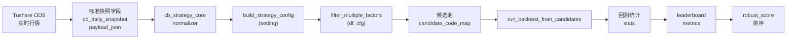

# cb_quant 数据字典

## 1. 范围说明

本文档覆盖 `cb_quant / cb_strategy_core` 运行链路里的业务字段，按以下 6 类整理：

1. 标准历史快照字段：最终写入 `cb_daily_snapshot.payload_json`
2. 策略默认配置字段：多因子筛债使用的 `cfg`
3. 任务运行参数字段：优化/回测任务对 `setting` 的覆盖字段
4. 候选池与打分派生字段：筛债过程中临时计算出来的字段
5. 轻量回测统计字段：单窗口回测输出
6. 排行榜/优化排序字段：由回测统计进一步转换的指标

不在本文档范围内的字段：

- 通用 API 包装字段，如 `ok`、`message`、`page`、`page_size`
- 前端展示状态字段，如局部 loading 状态、轮询时间戳
- SQLite 表通用管理字段，如 `id`、`updated_at`、`created_at`

## 2. 总体数据流

## 3. 全局口径

### 3.1 标准快照 schema 约束

标准快照字段由 `vnpy/web/domain/cb_quant/snapshot_schema.py` 定义，所有写库路径都必须先收口到这份 schema。

统一规则：

- 未在标准 schema 中定义的历史兼容字段不会写入 `cb_daily_snapshot.payload_json`
- 数值字段统一转为 `float`
- `is_listed`、`was_listed_prev_day` 统一转为 `Y/N`
- `is_redeem_triggered` 统一转为 `True/False`
- `days_to_redeem` 统一转为 `int | null`
- 如果 `bond_pure_value_ratio <= 0`，则按 `close_price / pure_bond_value` 重新补算；若 `pure_bond_value <= 0`，回退为 `1.0`

### 3.2 计量单位约定

- 价格、估值类字段默认单位为元
- `conversion_premium_pct`、`bond_pct_change`、`underlying_pct_change`、`ytm_to_maturity_pct`、`ytm_to_put_pct` 等字段按“百分数值”存储，例如 `12.5` 表示 `12.5%`
- `underlying_market_cap_yi` 当前口径为亿元
- `outstanding_amount_yi` 当前口径为亿元
- `days_to_redeem` 单位为自然日

## 4. 标准快照字段

这些字段最终存于 `cb_daily_snapshot.payload_json`，是策略核心和历史回放的唯一标准输入。

| 字段 | 中文名 | 含义 | 公式/规则 | 用途 | 来源 |
| --- | --- | --- | --- | --- | --- |
| `bond_code` | 可转债代码 | 6 位可转债代码 | Tushare 路径由 `ts_code -> code6`；实时行情路径由 `bond_id -> code6` | 作为快照主键和回测索引 | `cb_tushare_service._build_factor_and_snapshot_rows` / `cb_history_service._market_row_to_backtest_row` |
| `bond_name` | 可转债名称 | 转债简称 | 直接取上游名称，空值补空串 | 展示、过滤 `EB`、结果输出 | 同上 |
| `underlying_stock_code` | 股票代码 | 对应正股 6 位代码 | Tushare 路径来自 `stk_code`；实时行情路径来自 `stock_id` 去市场前缀 | 展示、穿透正股信息 | 同上 |
| `underlying_stock_name` | 股票名称 | 对应正股简称 | 直接取上游名称，空值补空串 | 展示、辅助研判 | 实时行情直接映射；Tushare 路径当前可能为空 |
| `close_price` | 转债价格 | 当日用于回测的债券价格 | Tushare 路径优先 `close`，其次 `pre_close`，再其次最近有效价；实时行情路径直接取 `close_price` | 候选打分、收益计算、止盈止损 | 同上 |
| `bond_pct_change` | 转债涨跌幅 | 当日转债涨跌幅 | 直接取上游百分比值，缺省 `0` | 展示、扩展分析 | 实时行情 `increase_rt`；Tushare 标准快照当前默认 `0` |
| `conversion_premium_pct` | 转股溢价率 | 转债相对转股价值的溢价率 | 直接取 `bond_prem/premium_rt/premium_rate` | 多因子评分核心因子 | 同上 |
| `conversion_price` | 转股价格 | 当前转股价 | 直接取 `convert_price`，缺省 `0` | 展示、扩展分析 | 实时行情 `convert_price`；Tushare 路径当前默认 `0` |
| `pure_bond_value` | 纯债价值 | 按纯债估值得到的债底价值 | Tushare 路径取 `bond_value/pure_bond_value`；实时行情取 `pure_bond_value` | 计算 `bond_pure_value_ratio` | 同上 |
| `option_value` | 期权价值 | 期权价值估计 | 实时行情取 `option_value`；其他路径缺省 `0` | 展示、扩展分析 | 同上 |
| `bond_pure_value_ratio` | 转债价格/纯债价值 | 债价相对债底的倍数 | `close_price / pure_bond_value`；若 `pure_bond_value <= 0` 回退 `1.0` | 过滤极端估值样本 | 同上，写库前还会二次补算 |
| `underlying_volatility` | 正股波动率 | 正股波动强度近似值 | Tushare 路径用 `abs(stock_pct_chg) * 1.5 + 20` 后截断到 `[10, 60]`；实时行情直接取 `stock_volatility` | 多因子评分核心因子 | 同上 |
| `underlying_close_price` | 股价 | 对应正股价格 | 直接取上游股价 | 强赎判断、展示 | 同上 |
| `underlying_pct_change` | 股价涨跌幅 | 当日正股涨跌幅 | 直接取上游百分比值 | 展示、扩展分析 | 同上 |
| `underlying_pb` | 市净率 | 正股 PB | Tushare 路径取 `pb/pb_new`；实时行情取 `stock_pb` | 多因子评分核心因子 | 同上 |
| `underlying_market_cap_yi` | 股票市值 | 正股市值 | Tushare 路径取 `total_mv/circ_mv` 后除以 `10000`；实时行情路径优先使用上游正股市值，若缺失则由 `outstanding_amount_yi / outstanding_to_market_cap_ratio` 反推 | 多因子评分核心因子 | 同上 |
| `outstanding_amount_yi` | 剩余规模 | 转债当前剩余规模 | Tushare 路径取 `issue_size/actual_issue_scale`，无值时回退 `10`；实时行情取 `remain_scale_yi` | 多因子评分核心因子 | 同上 |
| `outstanding_to_market_cap_ratio` | 转债剩余/市值比例 | 转债规模相对正股市值的占比 | 直接取上游；无值时 `0` | 扩展分析 | 实时行情 `float_mv_ratio`；Tushare 路径当前默认 `0` |
| `listing_date` | 发行日期 | 转债发行/上市日期 | Tushare 路径优先 `list_date`，再 `listing_date`；实时行情优先 `listed_date`，再 `subscribe_date` | 计算剩余期权价值近似项 | 同上 |
| `put_status` | 回售状态 | 当前是否已进入回售窗口 | 枚举值：`not_applicable / not_reached / active` | 候选前置过滤 | 同上 |
| `days_to_maturity` | 距离到期天数 | 剩余到期时间 | 标准化为 `int` 天数，缺省为 `0` | 候选过滤和到期短债处理 | 同上 |
| `days_to_conversion_start` | 距离转股开始天数 | 距离转股起始的剩余天数 | 标准化为 `int` 天数，缺省为 `0` | 展示、扩展分析 | 标准 schema 默认值 / 实时行情固定填充 |
| `is_listed` | 是否已上市 | 当日是否可交易 | 标准化为 `bool`，正常可交易样本为 `True` | 候选前置过滤 | 当前写库路径统一填 `True` |
| `was_listed_prev_day` | 上一交易日是否已上市 | 上一交易日是否可交易 | 标准化为 `bool` | 历史兼容字段，目前主要用于保留口径 | 当前写库路径统一填 `True` |
| `is_redeem_triggered` | 是否满足强赎条件 | 当前是否命中强赎/强制卖出 | Tushare 路径来自事件表；实时行情路径按 `stock_price >= redeem_trigger_price` 推导 | 候选过滤、回测卖出 | 同上 |
| `redeem_status` | 强赎状态 | 强赎事件状态文本 | 直接取事件映射值，缺省空串 | 展示、扩展分析 | Tushare 事件表 / 实时行情当前缺省 |
| `days_to_redeem` | 强赎剩余天数 | 距离强赎生效还剩多少天 | 直接取事件映射值；写库时标准化为 `int/null` | 候选前置过滤 | Tushare 事件表；实时行情路径当前缺省 |
| `ytm_to_maturity_pct` | 到期收益率 | 持有到期收益率 | 直接取上游百分比值 | 展示、扩展分析 | 实时行情 `expiry_ytm_pre_tax`；Tushare 路径当前默认 `0` |
| `ytm_to_maturity_after_tax_pct` | 税后到期收益率 | 税后口径的到期收益率 | 直接取上游百分比值 | 展示、扩展分析 | 实时行情 `expiry_ytm_pre_tax`；Tushare 路径当前默认 `0` |
| `ytm_to_put_pct` | 回售收益率 | 按回售口径估算收益率 | 直接取上游百分比值 | 展示、扩展分析 | 实时行情 `put_ytm`；Tushare 路径当前默认 `0` |
| `market` | 市场 | 证券市场，如 `sh`、`sz` | 直接取或由代码前缀推导 | 展示、扩展分析 | 同上 |
| `rating` | 债券评级 | 转债信用评级 | 直接取上游文本 | 展示、扩展分析 | 实时行情；Tushare 路径当前默认空串 |
| `turnover_amount_wan` | 成交额 | 当日成交额 | 直接取上游成交额 | 展示、扩展分析 | 实时行情 `amount_wan`；Tushare 路径当前默认 `0` |
| `data_source` | 行情来源 | 本行快照来自哪个数据源 | 取 `data_source` 或 `source`，写库前统一收口到 `data_source` | 数据追踪、问题排查 | `tushare.pro`、市场服务等 |

## 5. 策略参数 `strategy_parameters`

这些字段由 `cb_strategy_core/settings.py` 的 `StrategyParameters` 定义。它们只服务于筛债和打分，不承载调仓、仓位或任务调度语义。

| 字段 | 含义 | 默认值 | 公式/规则 | 用途 | 来源 |
| --- | --- | --- | --- | --- | --- |
| `bond_weight` | 债性打分权重 | `0.7` | 实际运行时按 `round(1 - stock_weight, 2)` 派生 | 计算 `bond_score` | `build_strategy_parameters` 派生 |
| `stock_weight` | 股性打分总权重 | `0.3` | 由外部参数透传 | 计算 `stock_score` | 策略参数 |
| `price_benchmark` | 价格基准 | `115` | 运行时最小钳制为 `0.01` | 计算 `price_score` | 策略参数 |
| `premium_benchmark` | 溢价率基准 | `25` | 运行时最小钳制为 `0.01` | 计算 `premium_score` | 策略参数 |
| `premium_weight` | 溢价率子因子权重 | `0.3` | 直接透传 | 参与 `stock_score` | 策略参数 |
| `volatility_weight` | 波动率子因子权重 | `0.2` | 直接透传 | 参与 `stock_score` | 默认配置 |
| `outstanding_amount_weight` | 剩余规模子因子权重 | `0.15` | 直接透传 | 参与 `stock_score` | 策略参数 |
| `market_cap_weight` | 市值子因子权重 | `0.15` | 直接透传 | 参与 `stock_score` | 默认配置 |
| `pb_weight` | PB 子因子权重 | `0.1` | 直接透传 | 参与 `stock_score` | 默认配置 |
| `option_time_weight` | 期权时间价值子因子权重 | `0.1` | 直接透传 | 参与 `stock_score` | 默认配置 |
| `option_days_benchmark` | 期权基准天数 | `360` | 距离到期低于该值时开始折减 `stock_option_score` | 计算 `option` | 默认配置 |
| `outstanding_amount_min_yi` | 剩余规模下界 | `3` | 小于下界时对 `remain_score` 做上浮奖励 | 计算 `remain` | 默认配置 |
| `outstanding_amount_max_yi` | 剩余规模上界 | `30` | 大于上界时对 `remain_score` 做衰减 | 计算 `remain` | 默认配置 |
| `outstanding_amount_score_min` | 剩余规模得分下限 | `0.6` | 高规模样本衰减后的下限 | 计算 `remain` | 默认配置 |
| `pb_benchmark` | PB 基准 | `1.5` | 用于 PB 偏离度计算 | 计算 `pb_score` | 默认配置 |
| `pb_score_min` | PB 得分下限 | `0.6` | `pb_score` 下限 | 计算 `pb_score` | 默认配置 |
| `market_cap_min_yi` | 市值下界 | `30` | 小于下界时给更高分 | 计算 `stock_market_cap` | 默认配置 |
| `market_cap_max_yi` | 市值上界 | `300` | 大于上界时做衰减 | 计算 `stock_market_cap` | 默认配置 |
| `market_cap_score_min` | 市值得分下限 | `0.6` | 截断下限 | 计算 `stock_market_cap` | 默认配置 |
| `market_cap_score_max` | 市值得分上限 | `1.5` | 截断上限 | 计算 `stock_market_cap` | 默认配置 |
| `volatility_benchmark` | 波动率基准 | `30` | 运行时最小钳制为 `0.01` | 计算 `stdevry` | 策略参数 |
| `volatility_score_min` | 波动率得分下限 | `0.6` | 截断下限 | 计算 `stdevry` | 默认配置 |
| `volatility_score_max` | 波动率得分上限 | `1.5` | 截断上限 | 计算 `stdevry` | 默认配置 |
| `max_candidate_price` | 价格上限 | `130` | 最终过滤时使用 | 排除高价债 | 策略参数 |
| `exclude_redeem_days_below` | 强赎剩余天数过滤阈值 | `null` | 若不为空，则仅保留 `days_to_redeem > 阈值` 或空值 | 排除临近强赎样本 | 任务配置覆盖 |

## 6. 回测运行参数 `runtime_config`

这些字段由 `BacktestRuntimeConfig` 定义，负责调仓节奏、持仓数量、仓位和止盈止损。它们不进入打分公式。

| 字段 | 含义 | 公式/规则 | 用途 | 来源 |
| --- | --- | --- | --- | --- |
| `candidate_count` | 每日候选池截断数量 | `>= max_hold_count`；优化时至少等于持仓数 | 控制 `build_candidates(...).head(candidate_count)` | 模板参数 + 任务合并 |
| `max_hold_count` | 最大持仓只数 | `>= 1` | 控制最多保留多少仓位 | 任务配置 |
| `hold_until_profit` | 未盈利不卖 | 布尔值 | 亏损仓位在调仓日可延迟退出 | 模板参数或运行参数 |
| `rebalance_interval_type` | 调仓频率类型 | `trade_day/calendar_day/week/month` | 判断是否到调仓日 | 任务配置 |
| `rebalance_interval_value` | 调仓频率数值 | `>= 1` | 与频率类型配合使用 | 任务配置 |
| `max_position_pct` | 单标的持仓上限 | 真实仓位取 `min(1/max_hold_count, max_position_pct/100)` | 控制单只仓位 | 任务配置 |
| `exclude_redeem_days_below` | 强赎过滤阈值 | 与策略参数中的同名字段保持一致 | 确保筛债与回测共用同一阈值 | 任务配置 |
| `take_profit_pct` | 止盈阈值 | 若 `pnl_pct >= take_profit_pct` 则卖出 | 风险控制 | 任务配置 |
| `stop_loss_pct` | 止损阈值 | 若 `pnl_pct <= -stop_loss_pct` 则卖出 | 风险控制 | 任务配置 |
| `initial_capital_wan` | 初始资金 | `> 0` | 展示、兼容未来资金曲线扩展 | 任务配置 |
| `benchmark_name` | 基准名称 | 文本 | 展示 | 任务配置 |

## 7. 候选池与打分派生字段

这些字段由 `filter_multiple_factors(...)` 在单日快照上计算，属于运行时派生字段，不写入标准快照库。

| 字段 | 含义 | 公式 | 用途 | 来源 |
| --- | --- | --- | --- | --- |
| `premium_score` | 溢价率得分 | `1 - (conversion_premium_pct - premium_benchmark) / premium_benchmark` | `stock_score` 子项 | `conversion_premium_pct` + `strategy_parameters` |
| `price_score` | 价格得分 | `1 - (close_price - price_benchmark) / price_benchmark` | `bond_score` 基础项 | `close_price` + `strategy_parameters` |
| `pb_score` | PB 得分 | `1 - (pb_benchmark - underlying_pb) / pb_benchmark` 后截断到 `[pb_score_min, 1]` | `stock_score` 子项 | `underlying_pb` + `strategy_parameters` |
| `days_elapsed` | 已经过天数 | `now_date - issue_date` | 中间过程，不落表 | `listing_date` |
| `days_remain` | 6 年期限剩余天数近似 | `365 * 6 - days_elapsed` | 计算 `option` | `listing_date` |
| `option_score` | 期权时间价值分 | 默认 `1`；当 `days_remain < option_days_benchmark` 时，`1 - (option_days_benchmark - days_remain) / option_days_benchmark` | `stock_score` 子项 | `listing_date` + `strategy_parameters` |
| `outstanding_amount_score` | 剩余规模得分 | 小规模加分，大规模衰减，最低不低于 `outstanding_amount_score_min` | `stock_score` 子项 | `outstanding_amount_yi` + `strategy_parameters` |
| `market_cap_score` | 市值得分 | 小市值加分，大市值衰减，再截断到 `[market_cap_score_min, market_cap_score_max]` | `stock_score` 子项 | `underlying_market_cap_yi` + `strategy_parameters` |
| `volatility_score` | 波动率得分 | `1 - (volatility_benchmark - underlying_volatility) / volatility_benchmark` 后截断到区间 | `stock_score` 子项 | `underlying_volatility` + `strategy_parameters` |
| `bond_score` | 债性总分 | `price_score * bond_weight` | 综合评分组成项 | `price_score` + `strategy_parameters` |
| `stock_score` | 股性总分 | `stock_weight * (premium_score * premium_weight + volatility_score * volatility_weight + outstanding_amount_score * outstanding_amount_weight + pb_score * pb_weight + option_score * option_time_weight + market_cap_score * market_cap_weight)` | 综合评分组成项 | 上述子因子 + `strategy_parameters` |
| `weight_score` | 综合权重分 | `bond_score + stock_score` | 最终排序字段 | `bond_score` + `stock_score` |

### 7.1 候选前置过滤规则

`filter_multiple_factors(...)` 在打分前先过滤掉以下样本：

| 条件 | 含义 | 用途 |
| --- | --- | --- |
| `put_status != not_applicable` | 排除无回售权状态异常样本 | 清洗无效样本 |
| `is_listed == True` | 仅保留可交易样本 | 清洗不可交易样本 |
| `bond_name` 不含 `EB` | 排除 EB | 保持策略池纯净 |
| `is_redeem_triggered == False` | 排除强赎样本 | 避免临近强赎 |
| `0.5 < bond_pure_value_ratio < 15` | 排除异常估值样本 | 去极值 |
| `days_to_redeem` 为空或大于阈值 | 若配置强赎天数阈值，则排除临近强赎 | 风险控制 |

### 7.2 最终入选规则

打分后还要满足：

- 要求 `days_to_maturity > 90`
- 要求 `weight_score > 1`
- 要求 `close_price <= max_candidate_price`
- 最终按 `weight_score` 降序排序，再由 `candidate_count` 截断

## 8. 轻量回测统计字段 `stats`

这些字段由 `run_backtest_from_candidates(...)` 输出，用于优化排序和分析展示。

| 字段 | 含义 | 公式 | 用途 | 来源 |
| --- | --- | --- | --- | --- |
| `total_return_pct` | 累计收益率 | `((equity_end - 1) * 100)` | 评价收益水平 | 日收益序列复利 |
| `max_drawdown_pct` | 最大回撤 | `abs(min(equity / max_equity - 1)) * 100` | 评价风险 | 净值曲线 |
| `return_drawdown_ratio` | 收益回撤比 | `total_return_pct / max_drawdown_pct`，分母为 0 时取 `0` | 风险收益比 | 回测统计 |
| `calmar_like` | Calmar 近似值 | 当前与 `return_drawdown_ratio` 同口径 | 历史兼容指标 | 回测统计 |
| `trade_count` | 成交次数 | `sell_win + sell_loss` | 统计换手和胜率 | 卖出统计 |
| `win_rate_pct` | 胜率 | `sell_win / trade_count * 100` | 评价交易质量 | 卖出统计 |
| `sample_days` | 样本天数 | `len(dataset)` | 年化、窗口稳定性计算 | 数据窗口长度 |
| `rebalanced_days` | 实际调仓日数 | 每次 `rebalance_due` 成功处理后加 1 | 计算换手强度 | 回测状态机 |

### 8.1 日收益与仓位规则

| 字段/规则 | 公式/规则 | 用途 |
| --- | --- | --- |
| `daily_ret` | `Σ ((cur_price - last_price) / last_price) * ratio` | 形成收益序列 |
| 单仓权重 `ratio` | `min(1 / max_hold_count, max_position_pct / 100)` | 近似仓位控制 |
| 首日建仓 | 从 `ranked_codes` 依次买入，直到 `max_hold_count` | 初始化持仓 |
| 强赎卖出 | `is_redeem_triggered == True` 时卖出 | 风险控制 |
| 止盈卖出 | `pnl_pct >= take_profit_pct` | 风险控制 |
| 止损卖出 | `pnl_pct <= -stop_loss_pct` | 风险控制 |
| `hold_until_profit` 保留 | 打开时，若 `cur_price <= buy_price`，调仓日也可继续持有 | 降低亏损换手 |
| 调仓补仓 | 仅在 `rebalance_due` 当日，从 `ranked_codes` 依次补足到 `max_hold_count` | 仓位轮动 |

## 9. 排行榜与优化排序字段

这些字段由 `CbQuantService._derive_leaderboard_metrics(...)` 由 `stats` 衍生而来。

| 字段 | 含义 | 公式 | 用途 | 来源 |
| --- | --- | --- | --- | --- |
| `cagr` | 年化复合收益率 | `((1 + total_return) ** (1 / years) - 1)`，其中 `total_return = total_return_pct / 100`，`years = max(0.1, sample_days / 244)` | 跨窗口收益对比 | `stats` |
| `mdd` | 最大回撤比例 | `max_drawdown_pct / 100` | 风险对比 | `stats` |
| `calmar` | Calmar 比率 | `cagr / mdd`；若 `mdd == 0`，取 `max(0, cagr)` | 风险收益综合指标 | `stats` |
| `win_rate` | 胜率 | 直接取 `win_rate_pct` | 交易质量对比 | `stats` |
| `turnover` | 换手强度 | `trade_count / rebalanced_days`，再截断到 `[0, 2]` | 排序惩罚项 | `stats` |
| `recent_1y` | 近期收益代理值 | 若窗口为 `1y` 或 `1w`，取 `total_return`；否则取 `cagr` | 同维度展示最近收益 | `stats` + `window` |
| `robust_score` | 稳健分 | 项目自定义综合分，见下表 | 最终排序主键之一 | `cagr/mdd/calmar/win_rate/turnover/window` |

### 9.1 `robust_score` 公式

#### `cagr <= 0.0001` 时

用于强惩罚零收益或负收益策略：

`score = 10 + clamp((win_rate_pct - 50) * 0.08, -4, 4) + clamp((0.08 - turnover) * 10, -4, 4)`

特殊规则：

- 若 `turnover < 0.01`，最高不超过 `6`
- 最终截断到 `[0, 25]`

#### `cagr > 0.0001` 时

`score = 55`

再叠加：

- `+ clamp(cagr * 120, -35, 35)`
- `+ clamp((0.25 - mdd) * 80, -20, 22)`
- `+ clamp(calmar * 6, -8, 18)`
- `+ clamp((win_rate_pct - 50) * 0.6, -10, 12)`
- `+ clamp((0.30 - turnover) * 20, -8, 8)`
- 若窗口为 `full`，额外 `+ 2`

最终截断到 `[0, 100]`

## 10. 字段对齐结论

### 10.1 已经统一的部分

- 历史快照写库字段与 `cb_strategy_core` 读取字段已经统一到 `snapshot_schema.py`
- 历史兼容字段不会再继续落入 `cb_daily_snapshot.payload_json`
- 多因子评分只依赖标准快照字段和标准 `cfg` 字段

### 10.2 当前仍属“展示或扩展字段”的部分

以下字段已经进入标准模型，但目前主要用于展示、日志或未来扩展，不直接参与当前轻量回测收益计算：

- `initial_capital_wan`
- `benchmark_name`
- `bond_pct_change`
- `underlying_pct_change`
- `conversion_price`
- `option_value`
- `ytm_to_maturity_pct`
- `ytm_to_maturity_after_tax_pct`
- `ytm_to_put_pct`
- `rating`
- `turnover_amount_wan`

## 11. 建议的后续治理方向

如果后续要继续收紧字段体系，建议按下面顺序推进：

1. 为 `underlying_stock_name`、`conversion_price`、`turnover_amount_wan` 在 Tushare 快照路径补齐更稳定的生产口径
2. 若后续要引入真实资金曲线与交易成本，再把 `initial_capital_wan`、手续费和滑点升级为生效字段
3. 为数据字典补一个“字段是否入库 / 是否仅运行时临时字段”的布尔列，方便前后端协作
