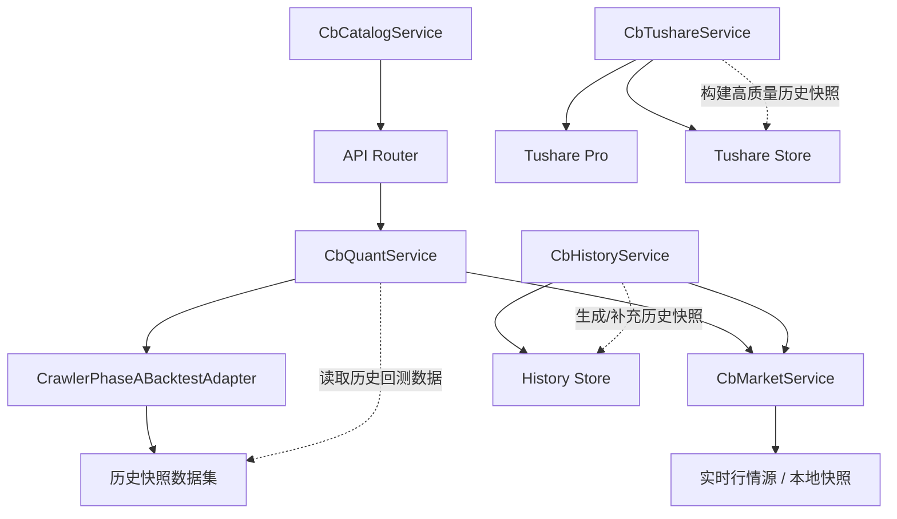

# CB Service 代码阅读导图

这份文档面向两个目标：

1. 快速建立 `vnpy/web/services` 里 5 个核心 service 的职责边界
2. 在排查“近一周回测 / 优化任务 / 行情同步”问题时，知道先看哪一层、打哪些断点

## 一、5 个 Service 的角色划分

### 1. `CbQuantService`

文件：[cb_quant_service.py](/Users/karekin/Downloads/coding/project/vnpy/vnpy/web/services/cb_quant_service.py)

这是整个可转债量化 Web 端的核心编排层，负责：

- 策略模板管理
- 参数空间展开
- 候选组合生成
- 优化任务创建与执行
- 回测作业创建与执行
- 排行榜、对比面板、分析详情汇总

如果你只读一个文件，优先读这个。

### 2. `CbTushareService`

文件：[cb_tushare_service.py](/Users/karekin/Downloads/coding/project/vnpy/vnpy/web/services/cb_tushare_service.py)

这是历史数据构建层，负责：

- 调 Tushare Pro 拉基础表、行情表、赎回事件表
- 把多张源表组装成回测可用的日快照
- 写入本地 store，供回测和历史查询复用

如果你怀疑“历史快照缺字段、强赎标志不对、价格回填异常”，先看这里。

### 3. `CbMarketService`

文件：[cb_market_service.py](/Users/karekin/Downloads/coding/project/vnpy/vnpy/web/services/cb_market_service.py)

这是实时行情读取层，负责：

- 抓取东财等实时市场数据
- 归一化成前端和策略共用的债券行情结构
- 在实时源失败时回退到本地快照或 mock

如果问题只出现在“当前市场 Top20/行情列表”，优先看这里。

### 4. `CbHistoryService`

文件：[cb_history_service.py](/Users/karekin/Downloads/coding/project/vnpy/vnpy/web/services/cb_history_service.py)

这是历史库存与定时同步层，负责：

- 从 crawler 快照导入历史回测数据
- 把 `CbMarketService` 当日行情转成回测快照行
- 启动后台线程做日常同步

可以把它理解成 `CbTushareService` 之外的另一条“历史数据落库入口”。

### 5. `CbCatalogService`

文件：[cb_catalog_service.py](/Users/karekin/Downloads/coding/project/vnpy/vnpy/web/services/cb_catalog_service.py)

这是静态目录查询层，负责：

- 因子目录
- 函数目录
- 类别解析

这个文件最简单，通常只在前端配置面板或目录接口异常时查看。

## 二、推荐阅读顺序

建议按下面顺序读，理解成本最低：

1. 先读 [cb_quant_service.py](/Users/karekin/Downloads/coding/project/vnpy/vnpy/web/services/cb_quant_service.py) 的模块注释和 `CbQuantService.__init__`
2. 再读 `create_optimize_task`、`_run_optimize_task`
3. 再读 `create_jobs`、`_run_job`
4. 再读 `_run_backtest_from_candidate_map`、`_simulate_detailed_strategy`
5. 然后读 [cb_tushare_service.py](/Users/karekin/Downloads/coding/project/vnpy/vnpy/web/services/cb_tushare_service.py) 的 `sync_range`、`sync_incremental`、`_build_factor_and_snapshot_rows`
6. 再读 [cb_market_service.py](/Users/karekin/Downloads/coding/project/vnpy/vnpy/web/services/cb_market_service.py) 的 `list_bonds`
7. 再读 [cb_history_service.py](/Users/karekin/Downloads/coding/project/vnpy/vnpy/web/services/cb_history_service.py) 的 `bootstrap_from_crawler_snapshots`、`sync_today_from_market`
8. 最后读 [cb_catalog_service.py](/Users/karekin/Downloads/coding/project/vnpy/vnpy/web/services/cb_catalog_service.py)

## 三、按场景找入口

### 场景 1：创建“策略优化任务”

先看这些方法：

- [create_optimize_task](/Users/karekin/Downloads/coding/project/vnpy/vnpy/web/services/cb_quant_service.py#L671)
- [_run_optimize_task](/Users/karekin/Downloads/coding/project/vnpy/vnpy/web/services/cb_quant_service.py#L1087)
- [_iter_combo_results_parallel](/Users/karekin/Downloads/coding/project/vnpy/vnpy/web/services/cb_quant_service.py#L1947)
- [_evaluate_combo](/Users/karekin/Downloads/coding/project/vnpy/vnpy/web/services/cb_quant_service.py#L2209)

理解顺序：

- `create_optimize_task` 负责入队和初始化任务行
- `_run_optimize_task` 负责两阶段筛选或全量遍历
- `_iter_combo_results_parallel` 负责并行执行
- `_evaluate_combo` 负责对单个参数组合做窗口回测并汇总指标

### 场景 2：创建“单次回测任务”

先看这些方法：

- [create_jobs](/Users/karekin/Downloads/coding/project/vnpy/vnpy/web/services/cb_quant_service.py#L1496)
- [_run_job](/Users/karekin/Downloads/coding/project/vnpy/vnpy/web/services/cb_quant_service.py#L1607)
- [_build_candidate_code_map](/Users/karekin/Downloads/coding/project/vnpy/vnpy/web/services/cb_quant_service.py#L2019)
- [_run_backtest_from_candidate_map](/Users/karekin/Downloads/coding/project/vnpy/vnpy/web/services/cb_quant_service.py#L2048)

理解顺序：

- `create_jobs` 创建作业和上下文
- `_run_job` 加载数据、调用 adapter、更新作业状态
- `_build_candidate_code_map` 把候选组合映射成每日可持仓代码集合
- `_run_backtest_from_candidate_map` 执行净值回放并产出主统计结果

### 场景 3：分析页明细为什么和主回测结果不同

先看这些方法：

- [get_optimize_task_analysis](/Users/karekin/Downloads/coding/project/vnpy/vnpy/web/services/cb_quant_service.py#L800)
- [_simulate_detailed_strategy](/Users/karekin/Downloads/coding/project/vnpy/vnpy/web/services/cb_quant_service.py#L2479)
- [_simulate_equal_weight_benchmark](/Users/karekin/Downloads/coding/project/vnpy/vnpy/web/services/cb_quant_service.py#L2708)
- [_compute_backtest_metrics](/Users/karekin/Downloads/coding/project/vnpy/vnpy/web/services/cb_quant_service.py#L2757)

关键点：

- `_run_backtest_from_candidate_map` 偏排行榜统计
- `_simulate_detailed_strategy` 偏分析页可视化和轮动记录
- 两者逻辑目标接近，但输出粒度不同，不要把它们当成完全同一套展示函数

### 场景 4：近一周窗口为什么没数据

先看这些方法：

- [_normalize_windows](/Users/karekin/Downloads/coding/project/vnpy/vnpy/web/services/cb_quant_service.py#L3692)
- [_prepare_window_dataset_map](/Users/karekin/Downloads/coding/project/vnpy/vnpy/web/services/cb_quant_service.py#L1819)
- `CrawlerPhaseABacktestAdapter` 的窗口切片逻辑

排查重点：

- 前端是否把 `1w` 发到了后端
- 后端是否把 `1w` 归一化成功
- 历史快照是否至少覆盖最近 7 个自然日内的交易日

### 场景 5：强赎/ST/因子字段为什么异常

先看这些方法：

- [sync_range](/Users/karekin/Downloads/coding/project/vnpy/vnpy/web/services/cb_tushare_service.py#L222)
- [_sync_event_ods](/Users/karekin/Downloads/coding/project/vnpy/vnpy/web/services/cb_tushare_service.py#L525)
- [_load_cb_call_map](/Users/karekin/Downloads/coding/project/vnpy/vnpy/web/services/cb_tushare_service.py#L789)
- [_build_factor_and_snapshot_rows](/Users/karekin/Downloads/coding/project/vnpy/vnpy/web/services/cb_tushare_service.py#L878)

关键点：

- 赎回标志来自事件表解析，不是简单实时字段
- 有些价格字段会走“沿用上一个有效价格”的补齐逻辑
- 回测读的是落库后的快照，不是每次现场重算

### 场景 6：实时市场 Top20 和历史回测候选不一致

先看这些方法：

- [list_bonds](/Users/karekin/Downloads/coding/project/vnpy/vnpy/web/services/cb_market_service.py#L151)
- [_score_current_market](/Users/karekin/Downloads/coding/project/vnpy/vnpy/web/services/cb_quant_service.py#L2410)

关键点：

- `list_bonds` 是实时或准实时行情
- `_score_current_market` 是拿“当前市场快照”套用最佳参数做即时排序
- 它和历史窗口回测使用的数据源、时点都不同，所以结果不要求完全一致

## 四、断点调试建议

### 1. 调“优化任务创建但没开始跑”

建议断点：

- [create_optimize_task](/Users/karekin/Downloads/coding/project/vnpy/vnpy/web/services/cb_quant_service.py#L671)
- [_run_optimize_task](/Users/karekin/Downloads/coding/project/vnpy/vnpy/web/services/cb_quant_service.py#L1087)

看这些变量：

- `request.windows`
- `windows`
- `task.total_combinations`
- `screening_enabled`
- `window_dataset_map`

### 2. 调“create_jobs 断点为什么不进”

建议先确认请求是不是：

- `POST /api/v1/cb-quant/backtest/jobs`

如果页面打的是：

- `POST /api/v1/cb-quant/strategy/optimize-tasks`

那应该断在 `create_optimize_task`，不是 `create_jobs`。

### 3. 调“近一周回测没有结果”

建议断点：

- [_normalize_windows](/Users/karekin/Downloads/coding/project/vnpy/vnpy/web/services/cb_quant_service.py#L3692)
- [_prepare_window_dataset_map](/Users/karekin/Downloads/coding/project/vnpy/vnpy/web/services/cb_quant_service.py#L1819)
- [_run_backtest_from_candidate_map](/Users/karekin/Downloads/coding/project/vnpy/vnpy/web/services/cb_quant_service.py#L2048)

看这些变量：

- `windows`
- `window_dataset_map["1w"]`
- `dataset`
- `candidate_code_map`

### 4. 调“净值和轮动记录不符合预期”

建议断点：

- [_simulate_detailed_strategy](/Users/karekin/Downloads/coding/project/vnpy/vnpy/web/services/cb_quant_service.py#L2479)

重点观察每个交易日循环里的这些变量：

- `candidate_codes`
- `rebalance_due`
- `holdings`
- `keep_list`
- `sell_list`
- `day_return`
- `day_turnover`

### 5. 调“历史快照本身就不对”

建议断点：

- [sync_range](/Users/karekin/Downloads/coding/project/vnpy/vnpy/web/services/cb_tushare_service.py#L222)
- [_build_factor_and_snapshot_rows](/Users/karekin/Downloads/coding/project/vnpy/vnpy/web/services/cb_tushare_service.py#L878)
- [sync_today_from_market](/Users/karekin/Downloads/coding/project/vnpy/vnpy/web/services/cb_history_service.py#L145)

## 五、5 个 Service 的依赖关系

可以用下面这张图理解：

简化理解：

- `CbQuantService` 是任务大脑
- `CbMarketService` 提供当前市场视角
- `CbTushareService` 负责高质量历史数据生产
- `CbHistoryService` 负责历史库存同步和补数
- `CbCatalogService` 提供静态目录

## 六、最值得先读的 10 个方法

如果你时间有限，优先读下面 10 个：

1. [CbQuantService.__init__](/Users/karekin/Downloads/coding/project/vnpy/vnpy/web/services/cb_quant_service.py#L113)
2. [create_optimize_task](/Users/karekin/Downloads/coding/project/vnpy/vnpy/web/services/cb_quant_service.py#L671)
3. [_run_optimize_task](/Users/karekin/Downloads/coding/project/vnpy/vnpy/web/services/cb_quant_service.py#L1087)
4. [create_jobs](/Users/karekin/Downloads/coding/project/vnpy/vnpy/web/services/cb_quant_service.py#L1496)
5. [_run_job](/Users/karekin/Downloads/coding/project/vnpy/vnpy/web/services/cb_quant_service.py#L1607)
6. [_run_backtest_from_candidate_map](/Users/karekin/Downloads/coding/project/vnpy/vnpy/web/services/cb_quant_service.py#L2048)
7. [_simulate_detailed_strategy](/Users/karekin/Downloads/coding/project/vnpy/vnpy/web/services/cb_quant_service.py#L2479)
8. [sync_range](/Users/karekin/Downloads/coding/project/vnpy/vnpy/web/services/cb_tushare_service.py#L222)
9. [_build_factor_and_snapshot_rows](/Users/karekin/Downloads/coding/project/vnpy/vnpy/web/services/cb_tushare_service.py#L878)
10. [list_bonds](/Users/karekin/Downloads/coding/project/vnpy/vnpy/web/services/cb_market_service.py#L151)

## 七、阅读时的一个建议

不要从底层工具函数开始读。

这套代码更适合按“用户动作 -> service 入口 -> 内部编排 -> 底层数据来源”来读：

1. 先找接口入口
2. 再看 service 主流程
3. 最后再下钻到辅助函数和数据构建细节

这样会比从 `_to_float`、`_env_int`、`_chunk` 这种工具函数往上拼装，快很多。
